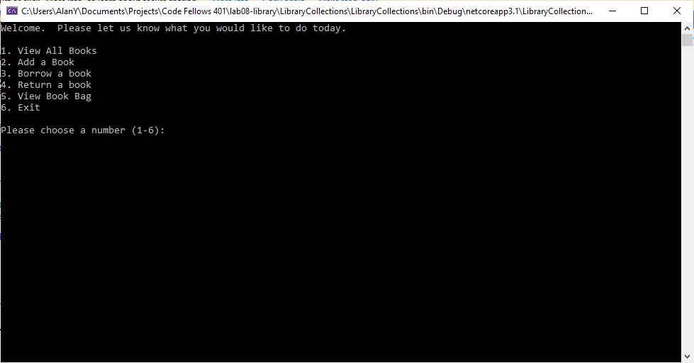
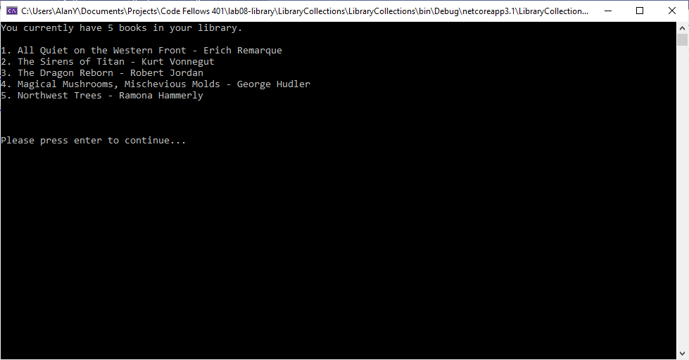
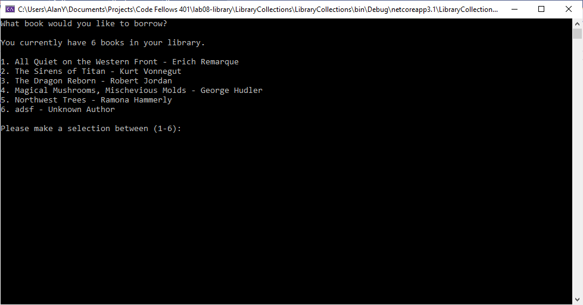
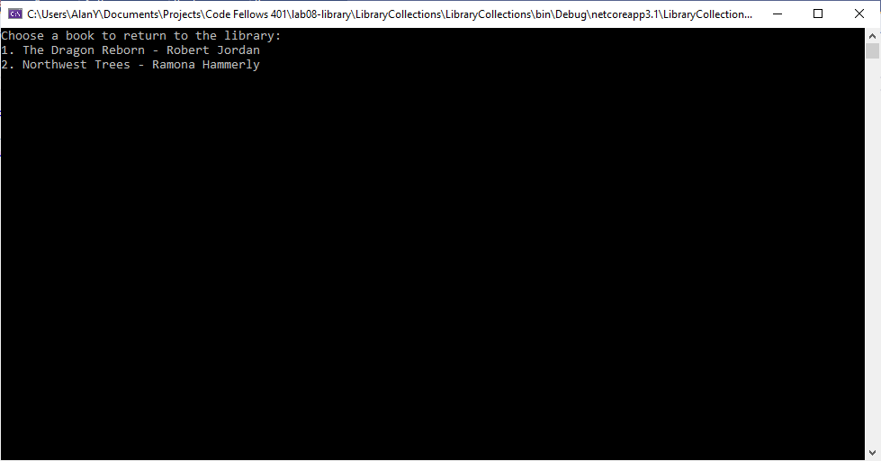
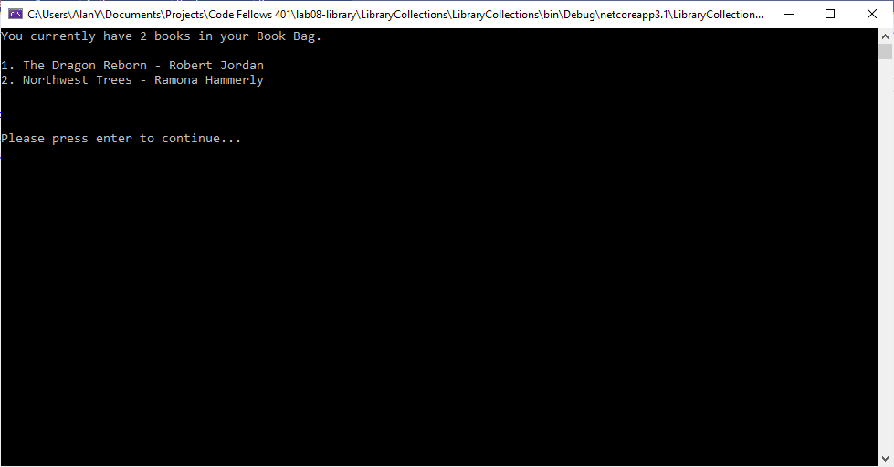

# Lab08-Collections, Enums, Dictionaries

## Authors: Alan Hung & Kjell Overholt

### Getting Started
* Open Visual Studio
* Clone [Lab 08 Git Repository](https://github.com/AlanYHung/Lab08-CollectionsLibraryDotNet)
* Click Run

### Example
* 
* 
* 
* 
* 

### Change Log
* 0.0.1 - 1/20/2021 2:15pm - Set up initial repo
* 0.1.0 - 1/20/2021 2:20pm - Completed Author Class
* 0.2.0 - 1/20/2021 2:30pm - Completed Book Class
* 0.3.0 - 1/20/2021 2:40pm - Completed Library Class
* 0.4.0 - 1/20/2021 2:45pm - Completed Main Class
* 0.5.0 - 1/20/2021 3:00pm - Completed User Main Menu Method
* 0.6.0 - 1/20/2021 4:30pm - Completed ViewAllBooks Method
* 0.7.0 - 1/20/2021 6:15pm - Completed Add Book Method + User Interface
* 0.8.0 - 1/20/2021 7:00pm - Completed Borrow Book Method
* 0.9.0 - 1/20/2021 7:15pm - Completed View Book Bag
* 1.0.0 - 1/20/2021 8:30pm - Completed Return Book and Unit Tests

### Attribution
* [Microsoft Docs](https://docs.microsoft.com/en-us/dotnet/csharp/language-reference/)
* [Stack Overflow](https://stackoverflow.com/)
* [Class Demo](https://github.com/codefellows/seattle-dotnet-401d12)
